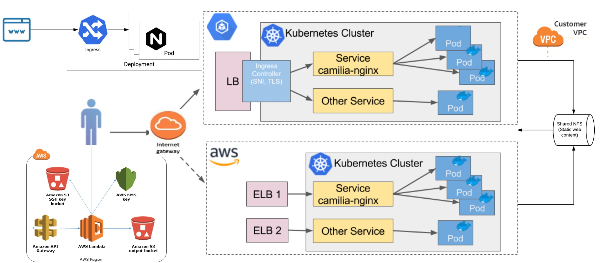

[![GoDoc Widget]][GoDoc] [](https://twitter.com/cloudrss)
# Create Kubernetes The Hard-Way HA Cluster Operations on Amazon AWS using kops by Terraform Code (*HashiCorp)
*Written by Kerem ÇELİKER*
 
This is a Terraform module which provides AWS EC2 (without EKS) and S3,Route53,VPC for publishing services via NGINX Ingress on Kubernetes Kops.


**It provides the following stack**



HTTPS requests are transfered to a pod via the external VPC and the node port of NGINX (e.g. tcp/31504).


 [[params.social]]
    icon = "twitter"
    icon_pack = "fa"
    link = "https://twitter.com/cloudrss"

## Pre-Requisites

- Terraform v12 (w/aws provider v2.57)
- Visual Studio Code
- Ubuntu AMI 16.04 or newer LTS
- Git
- Kops for Kubernetes Operations
- Kubectl for Kubernetes CLI
- Python3 Tool
- Pip3 Tool
- AWS CLI for AWS Operations
- PuttyGen


## This module assumes the following resources exist:

- Create Route53 hosted zone of the domain `kubernetes_ingress_domain`
- Nice to have certificate of the wildcard domain `*.kubernetes_ingress_domain`
- VPC for the cluster `kops_cluster_name`
- Subnets for the cluster `kops_cluster_name`
- Use S3 bucket storage to needed create some storage space `kops_S3state_name`
- Kubernetes on Kops also needs `ssh key pair` to be able to connect to `EC2 Kubernetes` instances.
- Build Docker image if you want to upload images push it to dockerhub.com.`(Optionally)`
- Auto scaling group for the nodes of the cluster `kops_cluster_name`
- Security group for the masters of the cluster `kops_cluster_name`
- Security group for the nodes of the cluster `kops_cluster_name`


### 1) Local infrastructure:

1.1) *Assumptions:*
- Development machine is a Windows 10 Pro.
- User has admin privileges on the machine
- At least 15GB of free RAM is available on the development machine. Otherwise, Visual Code Studio will need editing to adjust available memory:
  -	`v.customize ["modifyvm", :id, "--memory", <MEMORY_ALLOCATION>]`

1.2) *Prerequisites:*
  -	Install latest version of  [Git bash](https://git-scm.com/downloads) for Windows Setup (As like me)
  -	Install latest version of [VMware Workstation](https://www.vmware.com/products/workstation-pro/workstation-pro-evaluation.html)
  -	Install latest version of  [Visual Studio Code](https://code.visualstudio.com/download)
  - Install latest version of [Terraform CLI by HashiCorp](https://www.terraform.io/downloads.html)
  - Install latest version of [AWS CLI](https://docs.aws.amazon.com/cli/latest/userguide/cli-chap-configure.html)
  - Install latest version of Kubernetes [KubeCtl - Kubernetes CLI](https://docs.aws.amazon.com/eks/latest/userguide/install-kubectl.html)
  - Install latest version of Kubernetes [Kops - Kubernetes CLI](https://github.com/kubernetes/kops/releases)
  ****************************
  **- Amazon AWS Cloud `EC2` preparation**
  
  
 
  **- Amazon AWS Cloud `Route53` preperation**
 
  
  
 **- Amazon AWS Cloud `S3` preperation**
  
  
  
  **- Amazon AWS Cloud `VPC` preparation**
  
  
  
  **- Amazon AWS Cloud `EBS` preparation**
  
  
  
  **- Amazon AWS Cloud `Elastic IPs` preparation**
  **- Amazon AWS Cloud `EC2 Auto Scaling` preparation**
  **- Amazon AWS Cloud `IAM` preparation**
  
### Same steps on Docker Container can also be done if you wish :-)


## Instructions on Kubernetes Concepts using `Infrastructure as a Code`

IAC allows infrastructure to be expressed as code in a simple, human readable language called and automate provisioning by Terraform/GitLab or Ansible/Packer

*Install Terraform for Linux :*
```
curl -LO https://releases.hashicorp.com/terraform/0.11.7/terraform_0.12_linux_amd64.zip
unzip terraform_0.12_linux_amd64.zip
chmod +x terraform_0.12_linux_amd64
sudo mv terraform_0.12_linux_amd64 /usr/local/bin/terraform
```
*Install Terraform for Windows :*
```
Install Terraform Exe in Windows 64-bit
Set the PATH to use terraform binaries "set PATH=%PATH%;C:\terraform"
Check Terraform version "Terraform --version"
```
*Install K8s Kubectl and Kops cli tool:*
```
After you install and run "kubectl.exe" into the C:\Kerem\* folder, you will receive output when you type "kubectl -- help" on Windows PowerShell.
After you install and run "kops.exe" into the C:\Kerem\*folder, you will receive output when you type "kubectl -- help" on Windows PowerShell.
```
*Install AWS cli tool:*
```
Download AWS CLI, execute the command line or PowerShell command below:
"aws --version"
```

- You just need to install the another tools mentioned above in the same way. I'm going through these steps not to repeat again.


## Correct K8s Code Approach by Terraform


**Kops_s3.tf**
```
cat kops_s3.tf
 
resource "aws_s3_bucket" "kops-kerem-S3" {
    bucket = "kops-kops-kerem-S3"
    acl = "private"
 
    tags {
        Name = "Kops kops-kerem-S3"
    }
}
```

**Provider.tf**
```
provider "aws" {
  
    profile = "default"
    region = "eu-west-2"  
}
```

**Variables.tf**

```
variable "region" {
  default = "eu-west-2"
  
}
resource "aws_instance" "KeremKubernetesCls" {
ami           = "ami-7ad7c21e"
instance_type = "t2.micro" 
  tags = { Name = "KubeKerem" }
  provisioner "local-exec" {
     command = "echo ${aws_instance.KeremKubernetesCls.private_ip} >> private_ips.txt"
  }
}
output "ip" {
    value = "${aws_instance.KeremKubernetesCls.public_ip}"
}

variable "SET_TO_PRIVATE_KEY" {
  default = "InputYourKey"
}
variable "SET_TO_PUBLIC_KEY" {
  default = "InputYourKey.pub"
}
```

**In order to determine the closest your data center follows page can be used**
*http://www.cloudping.info/*

**The easiest way to find EC2 AMI ID for Ubuntu Linux is by following the following site**
*https://cloud-images.ubuntu.com/locator/ec2/*


**Kubernetes.tf**
```
-The IDs you need to prepare for Kubernetes in terraform below. Accordingly, you just need to build your own structure with Resource and Output routings in Terraform"

locals = {
  cluster_name                 = "kops.keremceliker.com"
  master_autoscaling_group_ids = ["${aws_autoscaling_group.master-eu-west-2a-masters-kops-keremceliker-com.id}"]
  master_security_group_ids    = ["${aws_security_group.masters-kops-keremceliker-com.id}"]
  masters_role_arn             = "${aws_iam_role.masters-kops-keremceliker-com.arn}"
  masters_role_name            = "${aws_iam_role.masters-kops-keremceliker-com.name}"
  node_autoscaling_group_ids   = ["${aws_autoscaling_group.nodes-kops-keremceliker-com.id}"]
  node_security_group_ids      = ["${aws_security_group.nodes-kops-keremceliker-com.id}"]
  node_subnet_ids              = ["${aws_subnet.eu-west-2a-kops-keremceliker-com.id}"]
  nodes_role_arn               = "${aws_iam_role.nodes-kops-keremceliker-com.arn}"
  nodes_role_name              = "${aws_iam_role.nodes-kops-keremceliker-com.name}"
  region                       = "eu-west-2"
  route_table_public_id        = "${aws_route_table.kops-keremceliker-com.id}"
  subnet_eu-west-2a_id         = "${aws_subnet.eu-west-2a-kops-keremceliker-com.id}"
  vpc_cidr_block               = "${aws_vpc.kops-keremceliker-com.cidr_block}"
  vpc_id                       = "${aws_vpc.kops-keremceliker-com.id}"
}

```


## Create cluster Kubernetes Kops (Don't forget feed the $VPC variable)
```
*Example*

kops create cluster \
  --name=$DNS_ZONE \
  --state=s3://SOME_BUCKET \
  --node-count=2 \
  --zones=eu-west-2a,eu-west-2b \
  --node-size=t2.medium \
  --master-size=t2.small \
  --master-size m4.large \
  --dns-zone $DOMAIN \
  --topology=private \
  --networking=flannel \
  --cloud=aws \
  --ssh-public-key=./some_key \
```

*Don't forget to look into the S3 Bucket after Kops Creation Custer, Terraform and Kops will automatically read all Codes from Cloud S3 Bucket and prepare your Kubernetes infrastructure for the AWS environment.*


# Now you can ready to run by Terraform :
```
Kerem@Container:~terraform$ terraform init
Kerem@Container:~terraform$ terraform plan (Or use Validate)
Kerem@Container:~terraform$ terraform apply
```


**When your POC or Project work is complete, you can remove the entire environment with the following command with the following awesome command ;-)**
```
Kerem@Container:~terraform$ terraform destroy
```

kubectl get pods -o wide --all-namespaces

### Deploy & Publish NGINX Web-Site in Kubernetes

Once you have a Kubernetes cluster / infrastructure up and running, ssh on to the master node in gitbash. Then create secrets to be used with Web-Site and then deploy Hello Kubernetes Web Site stack using a simple cli. Follow these instructions:
1. `kubectl get pods`
2. `Create a Yaml Script for Serverless Web-Site and make upload to Terraform Stack Source`
3. `kubectl apply -f hello-k8s-deploy.yaml`
4. `kubectl get svc`. Wait a couple second or minutes until all Pods and Replicas are reported as deployed.


**You must be see as the follows information**
```
NAME                            TYPE           CLUSTER-IP          EXTERNAL-IP                   PORT(S)        AGE
NGINX Public Web-Site         LoadBalancer     100.64.0.1         kops.keremceliker.com         80:31958/TCP   2m26s
kubernetes                    ClusterIP        100.65.103.179         <none>                    443/TCP        59m
```
**Kerem@TanzuPrivateRelease$ kubectl get nodes**
```
NAME                                         STATUS   ROLES    AGE   VERSION
ip-172-20-43-42.eu-west-2.compute.internal   Ready    node     18h   v1.18
ip-172-20-46-91.eu-west-2.compute.internal   Ready    node     18h   v1.18
ip-172-20-53-78.eu-west-2.compute.internal   Ready    master   18h   v1.18
```
**Kerem@TanzuPrivateRelease$ kubectl cluster-info**
```
Kubernetes master is running at https://api.kops.keremceliker.com
KubeDNS is running at https://api.kops.keremceliker.com/api/v1/namespaces/kube-system/services/kube-dns:dns/proxy
```
**Kerem@TanzuPrivateRelease$ kubectl get all --all-namespaces**
```
NAMESPACE              NAME                                                                     READY   STATUS    RESTARTS   AGE
default                pod/my-nginx-deployment-7ddd8b97f8-225gr                                 1/1     Running   0          74m
kube-system            pod/dns-controller-7979bc486-g7vfc                                       1/1     Running   0          93m
kube-system            pod/etcd-manager-events-ip-172-20-53-78.eu-west-2.compute.internal       1/1     Running   0          91m
kube-system            pod/etcd-manager-main-ip-172-20-53-78.eu-west-2.compute.internal         1/1     Running   0          92m
kube-system            pod/kops-controller-v8g26                                                1/1     Running   0          92m
kube-system            pod/kube-apiserver-ip-172-20-53-78.eu-west-2.compute.internal            1/1     Running   2          92m
kube-system            pod/kube-controller-manager-ip-172-20-53-78.eu-west-2.compute.internal   1/1     Running   0          92m
kube-system            pod/kube-dns-autoscaler-594dcb44b5-q6z67                                 1/1     Running   0          93m
kube-system            pod/kube-dns-b84c667f4-6gb9v                                             3/3     Running   0          90m
kube-system            pod/kube-dns-b84c667f4-94qj7                                             3/3     Running   0          93m
kube-system            pod/kube-proxy-ip-172-20-43-42.eu-west-2.compute.internal                1/1     Running   0          82m
kube-system            pod/kube-proxy-ip-172-20-46-91.eu-west-2.compute.internal                1/1     Running   0          89m
kube-system            pod/kube-proxy-ip-172-20-53-78.eu-west-2.compute.internal                1/1     Running   0          91m
kube-system            pod/kube-scheduler-ip-172-20-53-78.eu-west-2.compute.internal            1/1     Running   0          91m
kubernetes-dashboard   pod/dashboard-metrics-scraper-c79c65bb7-ngqdj                            1/1     Running   0          38m
kubernetes-dashboard   pod/kubernetes-dashboard-56484d4c5-nxnff                                 1/1     Running   0          38m

NAMESPACE              NAME                                TYPE        CLUSTER-IP       PORT(S)         AGE
default                service/kubernetes                  ClusterIP   100.64.0.1       443/TCP         93m
default                service/my-nginx-service            NodePort    100.65.103.179   80:31504/TCP    71m
kube-system            service/kube-dns                    ClusterIP   100.64.0.10      53/UDP,53/TCP   93m
kubernetes-dashboard   service/dashboard-metrics-scraper   ClusterIP   100.65.82.6      8000/TCP        38m
kubernetes-dashboard   service/kubernetes-dashboard        ClusterIP   100.68.175.154   443/TCP         38m

NAMESPACE     NAME                             DESIRED   CURRENT   READY   UP-TO-DATE   AVAILABLE   NODE SELECTOR                     AGE
kube-system   daemonset.apps/kops-controller   1         1         1       1            1           node-role.kubernetes.io/master=   93m

NAMESPACE              NAME                                        READY   UP-TO-DATE   AVAILABLE   AGE
default                deployment.apps/my-nginx-deployment         1/1     1            1           74m
kube-system            deployment.apps/dns-controller              1/1     1            1           93m
kube-system            deployment.apps/kube-dns                    2/2     2            2           93m
kube-system            deployment.apps/kube-dns-autoscaler         1/1     1            1           93m
kubernetes-dashboard   deployment.apps/dashboard-metrics-scraper   1/1     1            1           38m
kubernetes-dashboard   deployment.apps/kubernetes-dashboard        1/1     1            1           38m

NAMESPACE              NAME                                                  DESIRED   CURRENT   READY   AGE
default                replicaset.apps/my-nginx-deployment-7ddd8b97f8        1         1         1       74m
kube-system            replicaset.apps/dns-controller-7979bc486              1         1         1       93m
kube-system            replicaset.apps/kube-dns-autoscaler-594dcb44b5        1         1         1       93m
kube-system            replicaset.apps/kube-dns-b84c667f4                    2         2         2       93m
kubernetes-dashboard   replicaset.apps/dashboard-metrics-scraper-c79c65bb7   1         1         1       38m
kubernetes-dashboard   replicaset.apps/kubernetes-dashboard-56484d4c5        1         1         1       38m
```

## If you want to easily manage your Kubernetes Infrastructure as a VMware Tanzu via vSphere GUI Interface, you can install and use the Kubernetes Dashboard as follows.

**Depending if you are using a config file, via command-line run**
```
Kerem@TanzuPrivateRelease$ kubectl proxy
```
or
```
Kerem@TanzuPrivateRelease$ kubectl --kubeconfig=kubeconfig proxy
```
You should get a similar response

Starting to serve on 127.0.0.1:8001

**Access the Kubernetes Web Administrator Dashboard with external URL or IP address as follows**


***How cool and exciting it, isn't it :-) 
------
***Automatization with Tanzu/Pivotal or OpenShift, Kubernetes and DevOps in Containers processes makes your life really absolutely easier and looking cool !


